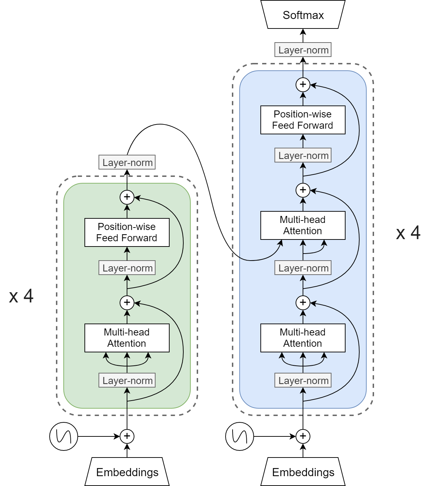

# MT Tutorial for the JSALT 2019 Summer School

This is the Machine Translation tutorial given at the 2019 JSALT summer school.

## Course Materials

Slides from the lecture are available [here](images/nmt_slides.pdf) .

## Lab session

### Setup

#### 1. Installing python and CUDA

You will need python >= 3.6 to run this tutorial. You can get a (relatively lightweight) distribution from [miniconda](https://docs.conda.io/en/latest/miniconda.html). You will also be requiring a version of [CUDA](https://developer.nvidia.com/cuda-toolkit) if you want to run the code on GPU. If you are attending the JSALT2019 summer school you should have access to a server with a GPU and CUDA.

#### 2. Installing PyTorch and other python packages

Next, install the required python packages (we recommend setting up a virtual environment: `pip install virtualenv && virtualenv env && source env/bin/activate` beforehand):

1. Install pytorch (for autodiff/GPU/neural networks): `pip install torch>=1.0` (if this doesn't work, see https://pytorch.org/get-started/locally/#start-locally for custom installation options depending on your environment). Also install tqdm (`pip install tqdm`) for progress bars.
2. Install sentencepiece (for subwords): `pip install sentencepiece`
3. Install sacrebleu (for evaluating BLEU score): `pip install sacrebleu`

#### 3. Get the data

We'll be doing French to English translation on the [IWSLT2016 dataset](https://sites.google.com/site/iwsltevaluation2016/). We've prepared the data for you, you can download it with:

```bash
wget https://github.com/pmichel31415/jsalt-2019-mt-tutorial/releases/download/1.0/data.zip
```

### Subwords

Before deciding on our model and training, we need to segment our data into sub-word units. This will allow us to handle out-of-vocabulary words by segmenting them into sub-word units. In particular, we'll be using the [Byte-Pair Encodings (BPE)](https://arxiv.org/abs/1508.07909) algorithm (described in the lecture).

We first learn a sub-word model from the data. Specifically, starting from single characters BPE will greedily group together frequently co-occuring subwords until the specified vocabulary size has been reached. You can train the sub-word model by running the `lab/subword.py` script:

```bash
python lab/subwords.py train \
    --model_prefix data/subwords
    --vocab_size 16000 \
    --model_type bpe \
    --input data/train.en,data/train.fr
```

Importantly, you'll notice that we are learning one sub-word model from both the French and English data. This is because we'll want to have a *shared* vocabulary between the source and target language. Since there is a significant amount of overlap between French and English vocabulary, this will make it easier for our model to map similar words together (e.g. `importance` -> `importance`, `docteur` -> `doctor` etc...).

Take a look at the vocabulary file containing all learned subwords with `less data/subwords.vocab`. You might recognize common vowels and even frequent words. Had we increased the target vocabulary size, we would've ended longer subwords on average. You will also notice the weird `▁` character. This is sentencepiece's way of indicating spaces. This makes it possible to distinguish subwords that occur at the start of words vs those that occurs with words.

We'll now use the trained sub-word model to segment existing sentences:

```bash
echo "JSALT summer school is positively interesting." | python lab/subwords.py segment --model data/subwords.model
```
produces
```
▁J SA L T ▁summer ▁school ▁is ▁positive ly ▁interesting .
```

You can see that:

1. spaces are replaced with `▁`
2. common words like `summer` and `interesting` are kept as-is
3. less common words are like the adverb `positively` are split (here the adverbializer `ly` is detached)
4. the unknown word JSALT is split into a lot of sub-words

For convenience we've provided the segmented versions of the data files in `data/*.bpe.{en,fr}`. Take a look to get an idea of what the segmented input look like!

### The Transformer Model

We're going to do translation with a variation on the transformer model from [Attention Is All You Need](https://arxiv.org/abs/1706.03762):

<div align="center">

</div>

This architecture relies on 3 different "modules":

- Word embeddings mapping word indices to learned vectors. This is implemented in pytorch with the `nn.Embedding`
- Multi-head attention. This is implemented in `MultiHeadAttention` in `lab/transformer.py`
- Position-wise feed-forward layers layers (2 layer MLP). Implemented as `FeedForwardTransducer`.

Additionally, it relies on position embeddings (to allow the model to consider each token's relative position), residual connections (for better gradient flow/expressivity at high layer counts) and layer normalization (to keep the amplitude of each layer in check).

In particular in our implementation we are using a small tweak on the original model where layer normalization is applied *before* each layer and *after* the residual connection. Empirically this makes the model converge faster.

**TODO 1**: We've implemented most of the transformer except for the forward methods of the encoder and decoder  layers ([`EncoderLayer`](https://github.com/pmichel31415/jsalt-2019-mt-tutorial/blob/master/lab/transformer.py#L137) and [`DecoderLayer`](https://github.com/pmichel31415/jsalt-2019-mt-tutorial/blob/master/lab/transformer.py#L177) in `lab/transformer.py`).

to verify that your implementation is correct, first download our pretrained model:

```bash
wget https://github.com/pmichel31415/jsalt-2019-mt-tutorial/releases/download/1.0/model.pt
```

And run

```bash
python lab/training.py --cuda --model-file model.pt --validate-only
```

If your implementation is correct this should give you a perplexity of 5.57 with the provided model.

### Training a model

You can train a transformer model by running `python lab\training.py`:

```bash
python lab/training.py \
    --cuda \
    --n-layers 4 \
    --n-heads 4 \
    --embed-dim 512 \
    --hidden-dim 512 \
    --dropout 0.1 \
    --lr 2e-4 \
    --n-epochs 15 \
    --tokens-per-batch 8000 \
    --clip-grad 1.0
```

This will train a transformer with the following parameters:

- `--cuda`: CUDA (train on GPU)
- `--n-layers 4`: 4 layers (both in the encoder and decoder)
- `--n-heads 4`: 4 attention heads in each attention layer
- `--embed-dim 512`: This sets the dimension of the model to 512 (including word embeddings)
- `--hidden-dim 512`: This sets the dimension of the hidden layer in the feedforward layers to 512
- `--dropout 0.1`: Dropout (set higher for more regularization)
- `--lr 2e-4`: Learning rate (`1/sqrt(embed_dim)` is a good heuristic)
- `--n-epochs 15`: Maximum number of epochs
- `--tokens-per-batch 8000`: Batch sentences together so that each batch contains at least 8000 tokens maximum
- `--clip-grad 1.0`: Clip gradient norm at 1.0

For convenience, we've trained a model for you (https://github.com/pmichel31415/jsalt-2019-mt-tutorial/releases/download/1.0/data.zip)

### Sampling from a trained model

One of the easiest way of generating a translation with the model is to sample from the conditional distribution one word at a time. This is implemented in `lab/decode.py`. However in order for decoding to be efficient, we need to implement another function in `DecoderLayer`:

**TODO 2**: Implement the `decode_step` method in [`DecoderLayer`](https://github.com/pmichel31415/jsalt-2019-mt-tutorial/blob/master/lab/transformer.py#L195). This method allows us to perform one step of decoding (return `log p (y_t | x, y_1,...,y_{t-1})`).

You can verify that your implementation is correct by running:

```bash
echo "▁J ' ai ▁donc ▁fait ▁le ▁tour ▁pour ▁essayer ▁les ▁autres ▁portes ▁et ▁fenêtres ." |
    python lab/translate.py --model-file model.pt --sampling
```

Which should return:

```
So I went all the way to try out the other doors and windows.
```

Congrats! You've just used your MT model to translate something for the first time.

Since we are doing random sampling, you can get different results by using a different random seed:


```bash
echo "▁J ' ai ▁donc ▁fait ▁le ▁tour ▁pour ▁essayer ▁les ▁autres ▁portes ▁et ▁fenêtres ." |
    python lab/translate.py --model-file model.pt --search "random" --seed 123456
```

should give:

```
Thus, I went around in order to try to other doors and windows.
```

### Greedy decoding

Random sampling is not optimal for decoding. Ideally we'd want to generate the argmax of the conditional distribution `p(y|x)`. However, with auto-regressive model that don't satisfy any kind of markov property this is intractable (we would need to explore an infinite number of possible translations).

A first approximation is to do "greedy" decoding: at each step fo decoding, instead of sampling, select the most probable token according to the model (Side question: why is this not the same as finding the argmax of `p(y|x)`? Can you come up with a simple example where this would be sub-optimal?).

**TODO 3**: Implement greedy decoding in [`lab/decoding.py`](https://github.com/pmichel31415/jsalt-2019-mt-tutorial/blob/master/lab/decoding.py#L38).

You can test your results by verifying that:

```bash
echo "▁J ' ai ▁donc ▁fait ▁le ▁tour ▁pour ▁essayer ▁les ▁autres ▁portes ▁et ▁fenêtres ." |
    python lab/translate.py --model-file model.pt --search "greedy"
```

Gives you 

```
So I went around to try and try the other doors and windows.
```

### Evaluating BLEU score

We're now ready to evaluate the model's BLEU score. You can translate a subet of the test data in `data/toy.test.bpe.fr` with

```
python lab/translate.py \
    --cuda \
    --model-file model.pt \
    --search "greedy" \
    --input-file data/toy.test.bpe.fr \
    --output-file toy.test.greedy.en
```

Take a look at the output file `toy.test.out.en` to get a feel of the translation quality. Now evaluate BLEU score with

```bash
cat toy.test.greedy.en | sacrebleu data/toy.test.en
```

You should get around **26.9** BLEU score.

**TODO 4**: Compare the BLEU scores with random and greedy decoding.

### Beam Search

As alluded to earlier, greedy decoding (while better than random sampling) is not optimal. For example, the first word completely determins the generated translation, with no chance to recover. *Beam search* is a slightly better approximation of the structured argmax problem.

In beam search, we keep track of the top `k` hypotheses (or *beams*) at every given step. Thus, hypotheses that have a lower probability in the first steps have a chance to recover.

**TODO 5**: Implement beam search in [`lab/decoding.py`](https://github.com/pmichel31415/jsalt-2019-mt-tutorial/blob/master/lab/decoding.py#L53). This is a bit harder than the previous exercises so don't hesitate to ask for help.

You can test your implementation by verifying that setting the beam size to 1 gives you the same result.

Can you get better BLEU score than with greedy decoding? Try:

```bash
python lab/translate.py \
    --cuda \
    --model-file model.pt \
    --search "beam_search" \
    --beam-size 2 \
    --input-file data/toy.test.bpe.fr \
    --output-file toy.test.beam.2.en
```

You should get a BLEU score of around **28.1**. This is pretty good considering that we didn't change the model at all! Try higher beam sizes.

You can try to improve your translation results by adding penalties for longer sentences, unknown words, etc... Try running your model on the full test set (`data/test.bpe.fr`) and report your best BLEU score.

## Organizers

### Jia Xu


Main instructor

Assistant Professor

Graduate Center and Hunter College

City University of New York (CUNY)

<br/>

### Paul Michel


Lab instructor

Phd Student

School of Computer Science

Carnegie Mellon University

<br/>

### Abdul Rafae Khan


Lab instructor

PhD Student

Graduate Center and Hunter College

City University of New York (CUNY)
