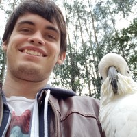

# MT Tutorial for the JSALT 2019 Summer School

## Course Materials

## Lab session

### Setup

#### 1. Installing python and CUDA

You will need python >= 3.6 to run this tutorial. You can get a (relatively lightweight) distribution from [miniconda](https://docs.conda.io/en/latest/miniconda.html). You will also be requiring a version of [CUDA](https://developer.nvidia.com/cuda-toolkit) if you want to run the code on GPU. If you are attending the JSALT2019 summer school you should have access to a server with a GPU and CUDA.

#### 2. Installing PyTorch and other python packages

Next, install the required python packages (we recommend setting up a virtual environment: `pip install virtualenv && virtualenv env && source env/bin/activate` beforehand):

1. Install pytorch (for autodiff/GPU/neural networks): `pip install torch>=1.0` (if this doesn't work, see https://pytorch.org/get-started/locally/#start-locally for custom installation options depending on your environment)
2. Install sentencepiece (for subwords): `pip install sentencepiece`
3. Install sacrebleu (for evaluating BLEU score): `pip install sacrebleu`

#### 3. Get the data

We'll be doing French to English translation on the [IWSLT2016 dataset](https://sites.google.com/site/iwsltevaluation2016/). We've prepared the data for you, you can download it from https://drive.google.com/file/d/1UaWMQRFaVDfyimw-A29bkffh-hmFBedh/view?usp=sharing

TODO: wget

### Subwords

Before deciding on our model and training, we need to segment our data into sub-word units. This will allow us to handle out-of-vocabulary words by segmenting them into sub-word units. In particular, we'll be using the [Byte-Pair Encodings (BPE)](https://arxiv.org/abs/1508.07909) algorithm (described in the lecture).

We first learn a sub-word model from the data. Specifically, starting from single characters BPE will greedily group together frequently co-occuring subwords until the specified vocabulary size has been reached. You can train the sub-word model by running the `lab/subword.py` script:

```bash
python lab/subwords.py train \
    --model_prefix data/subwords
    --vocab_size 16000 \
    --model_type bpe \
    --input data/train.en,data/train.fr
```

Importantly, you'll notice that we are learning one sub-word model from both the French and English data. This is because we'll want to have a *shared* vocabulary between the source and target language. Since there is a significant amount of overlap between French and English vocabulary, this will make it easier for our model to map similar words together (e.g. `importance` -> `importance`, `docteur` -> `doctor` etc...).

Take a look at the vocabulary file containing all learned subwords with `less data/subwords.vocab`. You might recognize common vowels and even frequent words. Had we increased the target vocabulary size, we would've ended longer subwords on average. You will also notice the weird `▁` character. This is sentencepiece's way of indicating spaces. This makes it possible to distinguish subwords that occur at the start of words vs those that occurs with words.

We'll now use the trained sub-word model to segment existing sentences:

```bash
echo "JSALT summer school is positively interesting." | python lab/subwords.py segment --model data/subwords.model
```
produces
```
▁J SA L T ▁summer ▁school ▁is ▁positive ly ▁interesting .
```

You can see that:

1. spaces are replaced with `▁`
2. common words like `summer` and `cool` are kept as-is
3. less common words are like the adverb `positively` are split (here the adverbializer `ly` is detached)
4. the unknown word JSALT is split into a lot of sub-words

For convenience we've provided the segmented versions of the data files in `data/*.bpe.{en,fr}`. Take a look to get an idea of what the segmented input look like!

### The Transformer Model


### Sampling from a trained model

```bash
echo "▁J ' ai ▁donc ▁fait ▁le ▁tour ▁pour ▁essayer ▁les ▁autres ▁portes ▁et ▁fenêtres ." |
    python lab/translate.py --model-file model.pt --sampling
```

```
So I went all the way to try out the other doors and windows.
```

Try out another seed


```bash
echo "▁J ' ai ▁donc ▁fait ▁le ▁tour ▁pour ▁essayer ▁les ▁autres ▁portes ▁et ▁fenêtres ." |
    python lab/translate.py --model-file model.pt --sampling --seed 123456
```

```
Thus, I went around in order to try to other doors and windows.
```

### Greedy decoding

TODO

## Organizers

### Jia Xu


[Jia bio]

### Paul Michel



[Paul bio]

### Abdul Rafae Khan


[Abdul bio]
